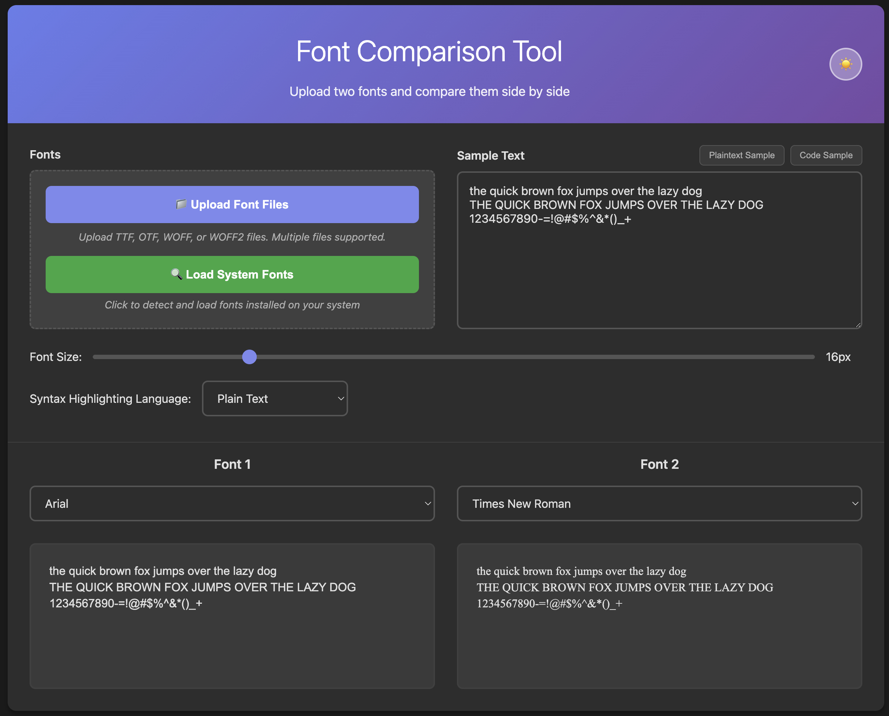
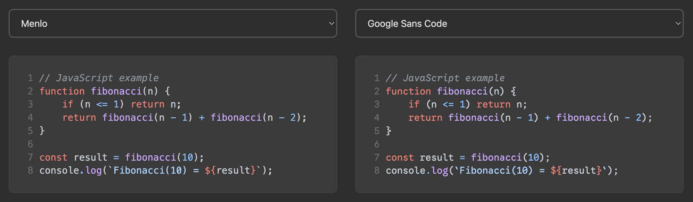

# Font Comparison Tool

A simple utility to compare two fonts side by side.

## Features

* **Upload Your Own Fonts:** "Upload" `.ttf`, `.otf`, `.woff`, or `.woff2` font files. Fonts are used locally in your browser only.
* **Use System Fonts:** Load and compare fonts already installed on your computer. (User permission required. Depending on [browser availability](https://developer.mozilla.org/en-US/docs/Web/API/Window/queryLocalFonts#browser_compatibility))
* **Live Preview:** See how your text looks with different fonts in real-time.
* **Adjustable Font Size:** Use a slider to change the font size.
* **Syntax Highlighting:** Preview how your code will look with different fonts and syntax highlighting themes.
  
  * Supported languages: Plain Text, JavaScript, TypeScript, Python, Java, C, Go, Rust, CSS, HTML, JSON, SQL, Bash, Markdown, XML, YAML
* **Light & Dark Mode:** Switch between light and dark themes for your comfort.

## How to Use

1. Upload font files or load system fonts.
2. Select a font for each of the two preview panes.
3. Type or paste text into the sample text area.
4. Adjust the font size and other settings as needed.

